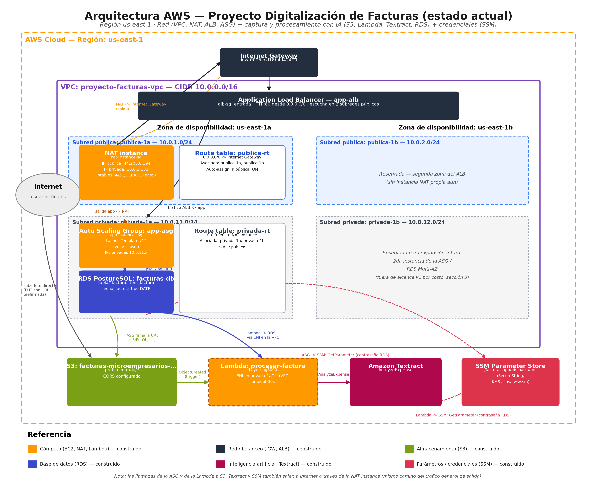
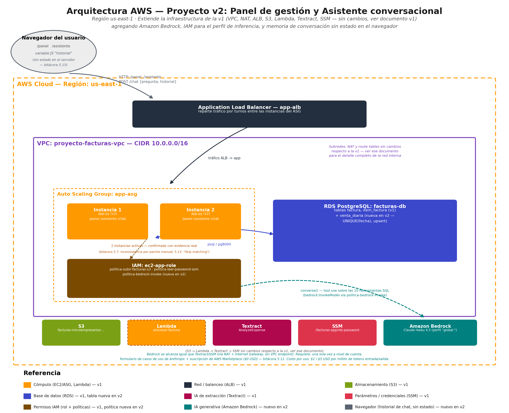

🌐 **Versión en español:** [README.md](README.md)

# Invoice digitization for small businesses (AWS)

Portfolio project built as part of my study for the AWS Cloud
Practitioner / AI Practitioner certifications. It solves a real problem
faced by small business owners in Colombia: digitizing paper invoices
and receipts by taking a single photo from a phone, with no manual
typing, and then offering a dashboard and a conversational assistant on
top of that already-digitized data.

The project was built in two stages. **Version 1** (capture and
digitization pipeline) was closed and verified end to end. **Version
2**, built on that same foundation, added a visual metrics dashboard, a
generative-AI conversational assistant (Amazon Bedrock) to query the
data in natural language, manual invoice editing, and a redesigned
interface.

## What it does

1. The user takes a photo of an invoice from a simple web page.
2. The photo is compressed in the browser and uploaded directly to
   Amazon S3 via a presigned URL (it never passes through the app
   server).
3. The upload to S3 automatically triggers an AWS Lambda function.
4. The Lambda sends the image to Amazon Textract (`AnalyzeExpense`),
   which extracts the vendor, date, total and each line item of the
   invoice — along with phone number, address, invoice number and buyer
   when the document carries them — with its own (non-blocking) numeric
   consistency checks.
5. The already-structured data is saved to a PostgreSQL database
   (Amazon RDS).
6. A query dashboard (`/facturas`) shows every processed invoice, with
   its line items, straight from the database — including a visible
   alert when the sum of the line items doesn't reconcile with the
   invoice total (with or without tax), computed at the moment the
   dashboard is rendered, so it also applies to invoices already
   processed.
7. A manual editing form (`/facturas/<id>/editar`) lets you correct any
   field of an already-processed invoice, for the cases where automatic
   extraction got it wrong or a value was simply missing.
8. A visual dashboard (`/panel`) summarizes spend (from the invoices)
   and daily sales (entered manually) with indicators and a trend chart
   (Chart.js).
9. A conversational assistant (`/asistente`), built on Amazon Bedrock
   (Claude Haiku 4.5 via a global inference profile), answers natural-
   language questions about spend, sales and invoices — always by
   running one of a fixed set of predefined SQL queries against RDS,
   never making up a figure on its own.
10. The same assistant also responds over WhatsApp
    (`/whatsapp-webhook`), as a proof of concept on Twilio's Sandbox,
    with its own per-phone-number conversation history stored in RDS.

## Interface

All 6 pages of the application share the same navigation and the same
visual system, built with Tailwind CSS (via CDN). The main dashboard
(`/`) and the invoice list (`/facturas`) are merged into a two-column
*bento grid* layout, instead of living as separate screens with no
visual relationship to each other.

## Architecture




- **Network:** VPC with public and private subnets across two
  availability zones, a NAT instance for outbound internet access from
  the private subnet, and a public Application Load Balancer.
- **Compute:** Auto Scaling Group with a versioned Launch Template; the
  Flask application runs in a Python virtual environment isolated from
  system dependencies.
- **Storage and data:** S3 for the original images, RDS (PostgreSQL) for
  the structured data (invoices, line items and daily sales).
- **Extraction AI:** Amazon Textract (`AnalyzeExpense`) to read the
  invoice.
- **Generative AI:** Amazon Bedrock (Claude Haiku 4.5, via a
  cross-region global inference profile) for the conversational
  assistant, using the *tool use* pattern of the Converse API — the
  model only drafts text from the real result of a SQL query, it never
  calculates or invents a financial figure on its own.
- **Credentials:** the RDS password is stored in SSM Parameter Store
  (SecureString) and read at runtime — it is not written in any code
  file.
- **IAM:** the application and Lambda roles are scoped to the exact
  actions and resources they need (no generic AWS-managed policies),
  including the specific permission to invoke the Bedrock inference
  profile.

## Repository structure

```
app/                            Flask application (photo upload, query dashboard, manual editing, visual dashboard and conversational assistant)
lambda/                         Lambda function that calls Textract, validates and saves the data to RDS
docs/                           Architecture diagrams, v2 build log and known limitations
```

## Documentation

- [`docs/BITACORA_V2.md`](docs/BITACORA_V2.md): step-by-step technical
  build log for v2, including the real bugs found and how they were
  fixed. (Written in Spanish.)
- [`docs/LIMITACIONES_CONOCIDAS.md`](docs/LIMITACIONES_CONOCIDAS.md):
  see the next section. (Written in Spanish.)

## How to deploy it in your own account

This repository does not include data or credentials from any AWS
account. Before deploying, you need:

1. A VPC with public/private subnets, an S3 bucket, an RDS (PostgreSQL)
   database with the `factura`, `item_factura` and `venta_diaria`
   tables, and a SecureString parameter in SSM Parameter Store holding
   the RDS password (`/facturas-app/rds-password`).
   Optional, only if you're enabling the WhatsApp channel: the
   `whatsapp_historial` table (see `docs/BITACORA_V2.md`, section 5.31)
   and a second SecureString parameter with a Twilio account's Auth
   Token (`/facturas-app/twilio-auth-token`) — in both cases, the
   instance role needs `ssm:GetParameter` permission on the new
   parameter, not just on the RDS password one.
2. In `app/app.py` and `lambda/lambda_procesar_factura.py`, replace
   `BUCKET_NAME`, `DB_HOST` and (only in `app/app.py`)
   `ID_MODELO_ASISTENTE` with the real values from your account (they
   are marked in the code with comments indicating where to find them
   in the AWS console).
3. Package `pg8000` (see `lambda/requirements-layer.txt`) as a Lambda
   Layer, since it is not included in the default Lambda runtime.
4. Configure the S3 bucket to trigger the Lambda on `s3:ObjectCreated`
   events under the `entrada/` prefix.
5. Request access to the Claude Haiku 4.5 model in the Amazon Bedrock
   console (Model access) and create/use a cross-region inference
   profile, so it can be invoked from the region where you deploy.
6. Deploy `app/app.py` (with the dependencies from
   `app/requirements.txt`) on the Auto Scaling Group's instances,
   behind the Application Load Balancer.

## Known limitations

See [`docs/LIMITACIONES_CONOCIDAS.md`](docs/LIMITACIONES_CONOCIDAS.md)
(in Spanish) for the details of three findings from the Textract
extraction stage: a real, already-fixed defect (currency symbols and
units in numeric fields), an OCR-service limitation with two-line-
per-item receipt formats, and a case of an undetected date on
handwritten invoices with separate boxes (DAY/MONTH/YEAR) — the latter
two documented and knowingly accepted rather than solved, each with the
real evidence behind that decision.

## Technologies

AWS: VPC, EC2, Auto Scaling Group, Application Load Balancer, S3,
Lambda, Textract, Bedrock, RDS (PostgreSQL), SSM Parameter Store, IAM.
Backend: Python, Flask, boto3, pg8000, Twilio (WhatsApp channel).
Frontend: Tailwind CSS (interface), Chart.js (visual dashboard).
